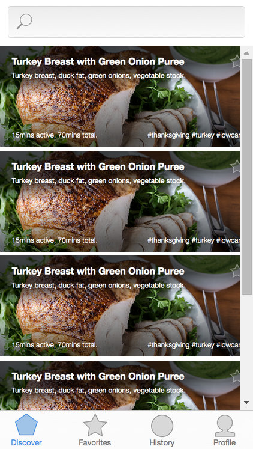
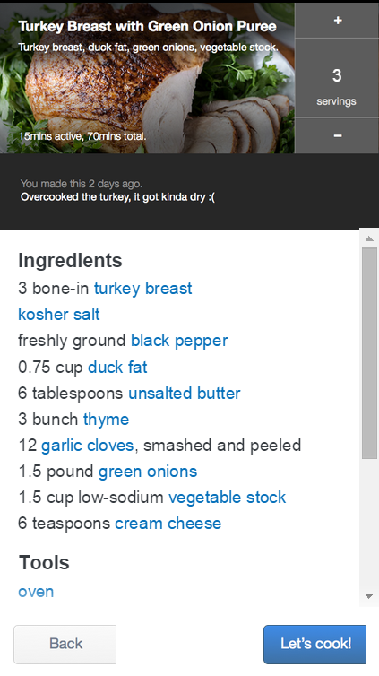
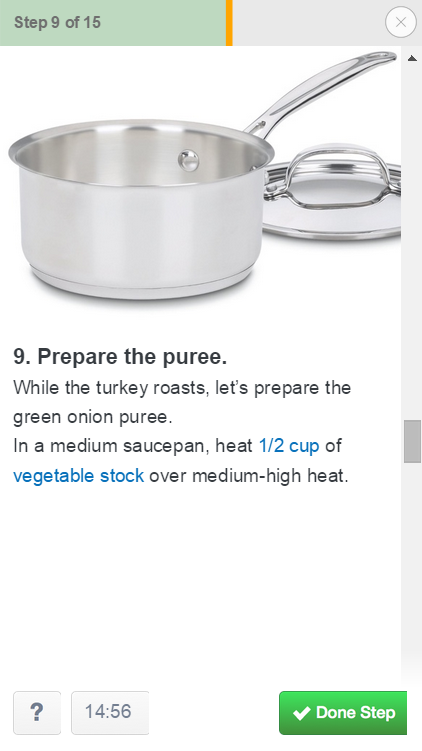
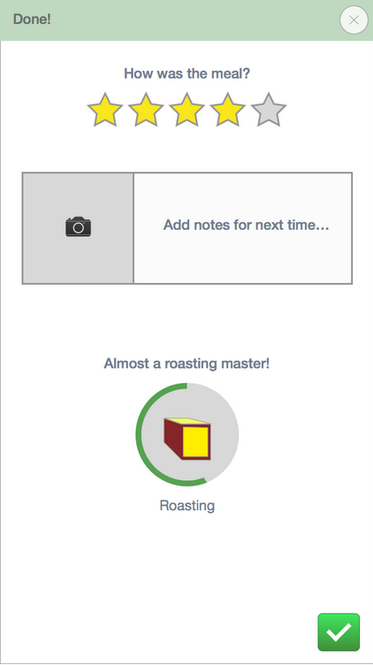

## Sous-Chef

Prototype of a cooking app built as part of a HCI (Human-Computer Interation) project.  
Built using [framer.js](http://framerjs.com/).  
Works only in Google Chrome

#### Features
* In-line unit conversion
* Dynamic measurements
* Context-based cooking timer

#### Demo
[Demo](http://ajitpawar.github.io/Sous-Chef/)

   
   
   
   

